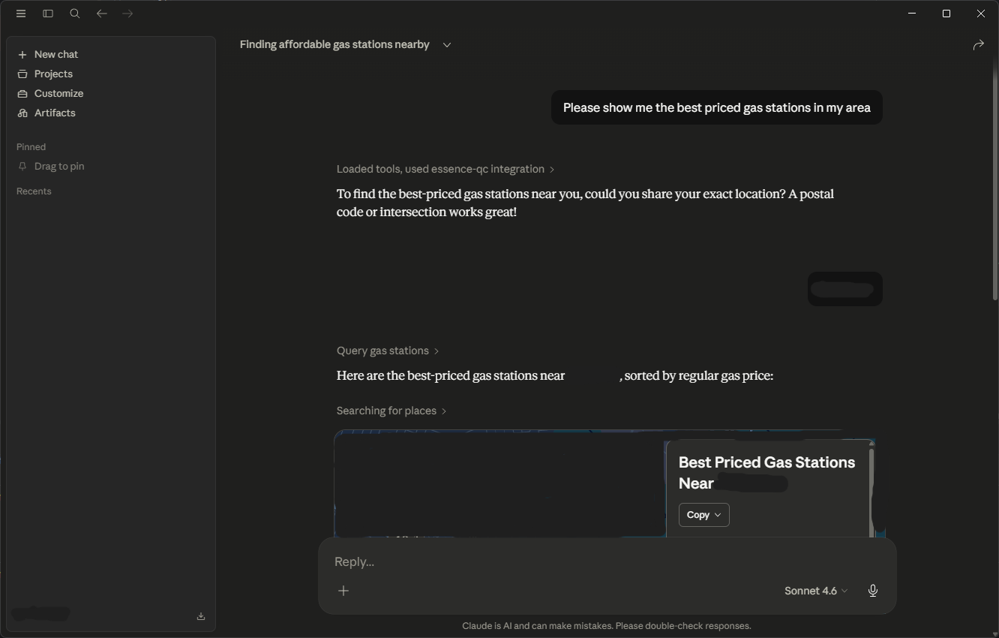
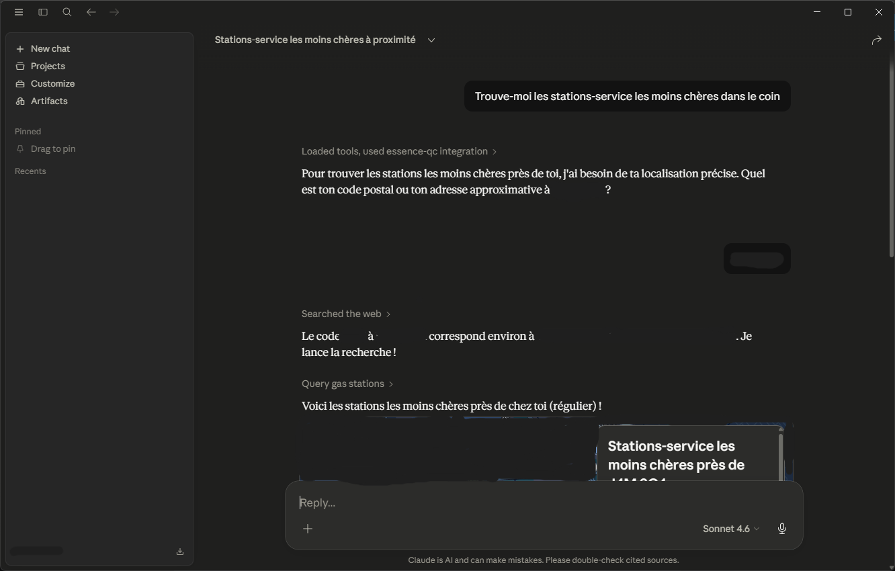

# MCP pour/for [Régie Essence Québec](https://regieessencequebec.ca/)

Demandez à votre agent préféré de trouver l’essence au meilleur prix près de chez vous ⛽ Ask your favorite agent to find the best priced gas around you




## Prerequisite

- [Node.js 22+](https://nodejs.org/en/download) (Should be included when you install Claude Desktop)
- MCP Client (e.g. Claude Desktop)

## How to Use

### MCPB (Easiest)

1. Find the latest [release](https://github.com/hawschiat/mcp-essence-qc/releases).
2. Download the latest `.mcpb` build.
3. Load the file to Claude Desktop to install the server.

> [!TIP]
> You may need to access Settings > Extensions to install the MCPB properly.
> Please see the detailed instructions at [Claude Docs](https://claude.com/docs/connectors/building/mcpb#how-users-install-your-mcpb).

### Build Locally

1. Pull this repo and install dependencies using `npm install`.
2. Build the server by running `npm run build`.
3. Configure your agent to use this MCP server.

#### Example: Claude Desktop

Add this to your `claude_desktop_config.json`:

```json
{
  "mcpServers": {
    "essence-qc": {
      "command": "node",
      "args": [
        "<PATH_TO_PROJECT>/mcp-essence-qc/dist/index.js"
      ]
    }
  }
}
```

Then, restart Claude desktop.

---

## Prérequis

- [Node.js 22+](https://nodejs.org/fr/download) (Devrait être inclus lors de l'installation de Claude Desktop)
- Un client MCP (par exemple : Claude Desktop)

## Comment s'en servir

### MCPB (Le plus facile)

1. Trouve [la dernière version (release)](https://github.com/hawschiat/mcp-essence-qc/releases).
2. Télécharge le plus récent fichier `.mcpb`.
3. Charge le fichier dans Claude Desktop pour installer le serveur.

> [!TIP]
> Vous devrez peut-être accéder à Paramètres > Extensions pour bien installer le MCPB.
> Instructions détaillées disponibles sur le site [Claude Docs](https://claude.com/docs/connectors/building/mcpb#how-users-install-your-mcpb).

### Bâtir localement

1. Clone le repo et installe les dépendances avec la commande `npm install`.
2. Bâtis le serveur en lançant `npm run build`.
3. Configure ton agent pour qu'il utilise ce serveur MCP.

#### Exemple : Claude Desktop

Ajoute ceci à ton fichier `claude_desktop_config.json`:

```json
{
    "mcpServers": {
      "essence-qc": {
        "command": "node", 
        "args": [
          "<CHEMIN_VERS_LE_PROJET>/mcp-essence-qc/dist/index.js"
        ]
      }
    }
}
```

Une fois que c'est fait, redémarre l'application Claude Desktop.
